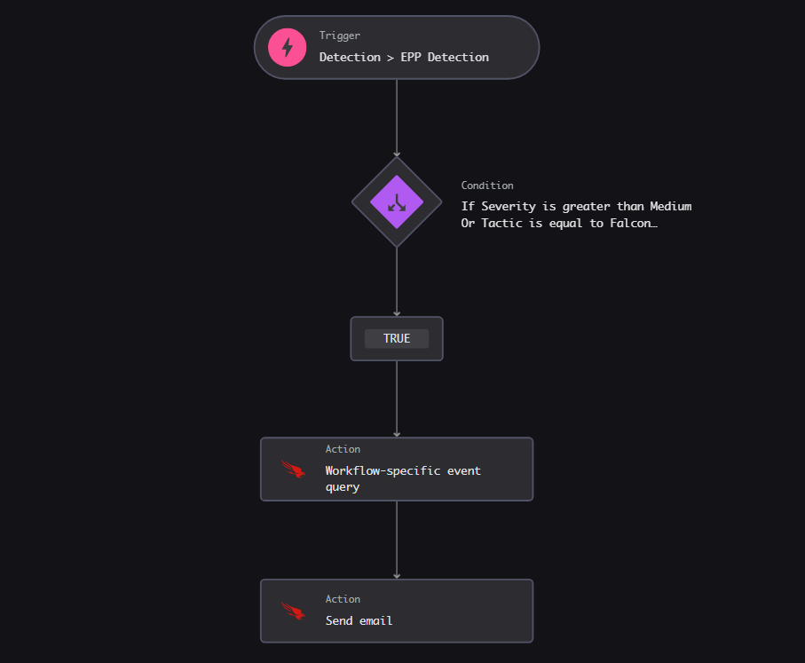

# Crowdstrike Detection Cmdline History

> A CrowdStrike Falcon SOAR workflow that automatically sends the command-line execution history of a compromised host via email when a **High/Critical severity** detection or a **Falcon OverWatch** detection occurs.

---

## Overview

When a **High/Critical severity** detection or a **Falcon OverWatch** detection is triggered, this workflow:

1. Queries the last **3 hours** of process execution history for the affected sensor
2. Builds a full **process lineage** chain (`GrandParent > Parent > Child`)
3. Exports the results as a **CSV file**
4. Sends the CSV as an **email attachment** to the configured recipients

This gives analysts immediate context about what was running on the host at the time of detection, without needing to manually query LogScale.

---

## Trigger Conditions

The workflow fires on an `Investigatable/EPP` detection signal when **at least one** of the following conditions is met:

<table width="100%">
<thead>
<tr><th align="left">Condition<div></div></th><th align="left">Value<div></div></th></tr>
</thead>
<tbody>
<tr><td>Severity</td><td><strong>High</strong> or <strong>Critical</strong> (&gt; Medium)</td></tr>
<tr><td>Tactic</td><td><strong>Falcon OverWatch</strong></td></tr>
</tbody>
</table>

---

## Workflow Steps



<table width="100%">
<thead>
<tr><th align="left">Step<div></div></th><th align="left">Type<div></div></th><th align="left">Description<div></div></th></tr>
</thead>
<tbody>
<tr><td>Detection &gt; EPP Detection</td><td>Trigger</td><td>Fires on every EPP detection event</td></tr>
<tr><td>Condition</td><td>Check</td><td>Severity &gt; Medium <strong>OR</strong> Tactic = Falcon OverWatch</td></tr>
<tr><td>Workflow-specific event query</td><td>Action</td><td>Queries last 3h of command-line history for the sensor</td></tr>
<tr><td>Send email</td><td>Action</td><td>Sends the CSV attachment to configured recipients</td></tr>
</tbody>
</table>

---

## CSV Output Fields

<table width="100%">
<thead>
<tr><th align="left">Field<div></div></th><th align="left">Description<div></div></th></tr>
</thead>
<tbody>
<tr><td><code>HumanTime</code></td><td>Process start time (formatted, America/Sao_Paulo)</td></tr>
<tr><td><code>UserName</code></td><td>User who executed the process</td></tr>
<tr><td><code>ComputerName</code></td><td>Hostname</td></tr>
<tr><td><code>CommandLine</code></td><td>Full command line</td></tr>
<tr><td><code>ProcessLineage</code></td><td><code>GrandParent &gt; Parent &gt; Child</code> chain</td></tr>
</tbody>
</table>

---

## Configuration

Before importing this workflow, update the following:

### Email Recipients

In `Files/Send-cmdline-history-email-on-detection.yaml`, locate the `SendEmail` action and add the recipient addresses:

```yaml
to:
  - analyst@yourcompany.com
  - soc-team@yourcompany.com
```

### Timeframe (optional)

The query defaults to the **last 3 hours**. To adjust, change the `logscale_search_start_time` value:

```yaml
logscale_search_start_time: 3 hr  # change as needed
```

---

## Requirements

- CrowdStrike Falcon with **SOAR / Fusion Workflows** enabled
- LogScale (Falcon Long Term Repository) with `ProcessRollup2` events ingested

---

## Import Instructions

1. In the Falcon console, navigate to **Fusion SOAR → Workflows**
2. Click **Import**
3. Upload `Files/Send-cmdline-history-email-on-detection.yaml`
4. Configure the email recipients
5. Activate the workflow

---

## Files

<table width="100%">
<thead>
<tr><th align="left">File<div></div></th><th align="left">Description<div></div></th></tr>
</thead>
<tbody>
<tr><td><code>Files/Send-cmdline-history-email-on-detection.yaml</code></td><td>Workflow definition (SOAR export)</td></tr>
<tr><td><code>Files/workflow-diagram.png</code></td><td>Workflow diagram screenshot</td></tr>
</tbody>
</table>

---

## License

This workflow template is provided as-is for reference and reuse. Adapt it freely to your environment.
